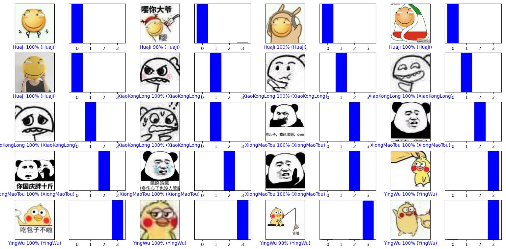

# Tensorflow学习笔记
正在学习中, 难免有纰漏。
## 文件结构
```
|--[OfficialTutorials]       //官方的Tutorials
|--[SourceImages]            //训练源图片 (dataset)
|--doc                       //储存一些文档所需要的文件
|--CNN                       //卷积神经网络的简单验证
|--FullyConnected            //全连接的简单验证
|--InceptionResNetV2         //InceptionResNetV2图像分类
```
具体每个文件夹下的说明可以点进文件夹查看对应Readme.

## FullyConnected
由全连接层构成的简单神经网络, 假阳性高。
反正一般只是拿它去了解神经网络。

## CNN
卷积神经网络的简单试验。

## InceptionResNetV2网络
一个准确率比较高的图像识别神经网络。
效果: 


其中, `[SourceImages]\garbage` 中部分图片来自于:   
https://github.com/garythung/trashnet/blob/master/data/dataset-resized.zip
`[SourceImages]\meme` 中部分图片由这位大佬收集:  
https://github.com/cyanray