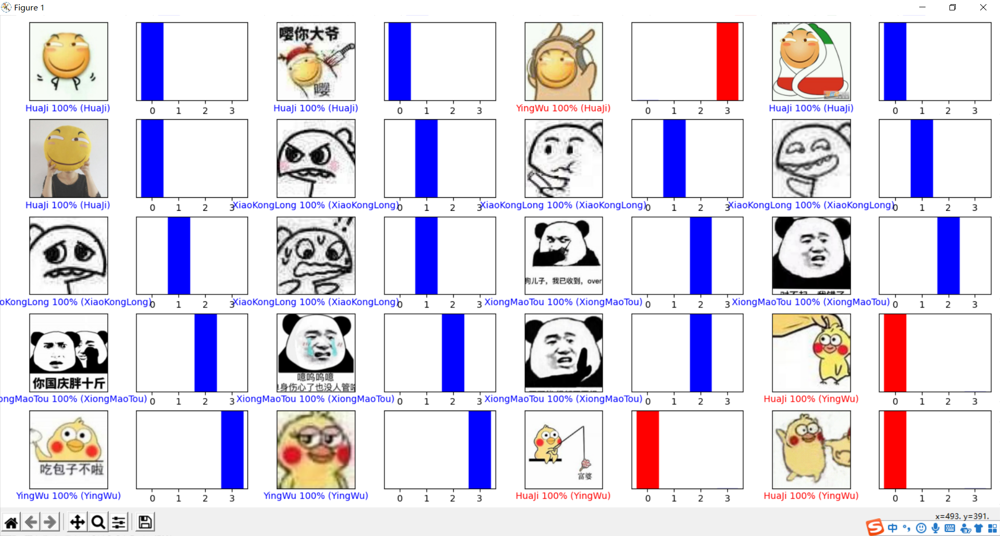
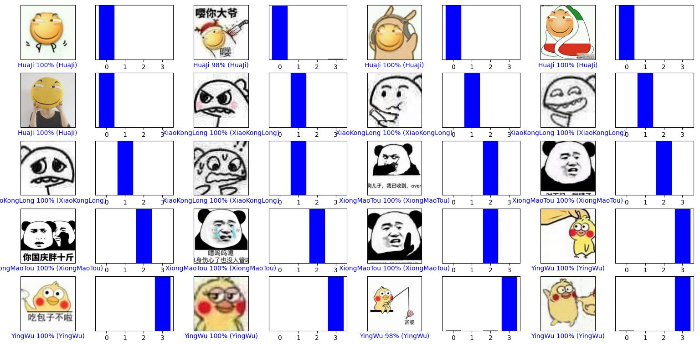

# Tensorflow学习笔记
正在学习中, 难免有纰漏。
## 文件结构
```
|--[OfficialTutorials]       //官方的Tutorials
|--[SourceImages]            //训练源图片 (dataset)
|--CNN                       //卷积神经网络的简单验证
|--FullyConnected            //全连接的简单验证
|--InceptionResNetV2         //InceptionResNetV2图像分类
```
具体每个文件夹下的说明可以点进文件夹查看对应Readme.

## FullyConnected
http://www.h13studio.com/TensorFlow%E5%9B%BE%E5%83%8F%E5%88%86%E7%B1%BB%E5%85%A5%E9%97%A8%E7%AC%94%E8%AE%B0/
由全连接层构成的简单神经网络, 假阳性高。
反正一般只是拿它去了解神经网络。
效果: 

效果很差, 反正也不会真的有人去用这个做图像分类。

## CNN
https://developers.google.cn/machine-learning/practica/image-classification
卷积神经网络的简单试验。

## InceptionResNetV2网络
http://www.h13studio.com/InceptionResNetV2%E5%9C%A8%E5%9B%BE%E5%83%8F%E5%88%86%E7%B1%BB%E4%B8%AD%E7%9A%84%E4%BD%BF%E7%94%A8/
一个准确率比较高的图像分类神经网络。
效果: 

在实际对meme数据集的训练中, 299*299分辨率分辨率下, batch_size为8, epoch为10的条件下, 有超过75%的概率可以获得一个如上图效果的权重文件。

其中, `[SourceImages]\garbage` 中部分图片来自于:   
https://github.com/garythung/trashnet/blob/master/data/dataset-resized.zip
`[SourceImages]\meme` 中部分图片由这位大佬收集:  
https://github.com/cyanray